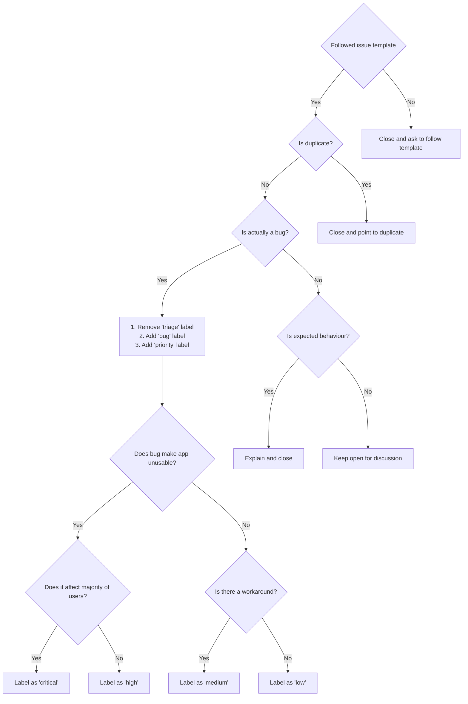

# TERArium Contributing Guide

Hi! We're really excited that you're interested in contributing to TERArium! Before submitting your contribution, please read through the following guide.

## Repo Setup

The TERArium repo is a mixed repo using yarn workspaces and Java backend components. The package manager used to install and link dependencies must be [yarn](https://yarnpkg.com/getting-started).

To develop and test the core application:

1. ???

## Debugging Front End

To debug the front end you need:

1. Add a `debugger` statement where you want to stop the code execution.

2. Click the "Run and Debug" icon in the activity bar of the editor, which opens the [_Run and Debug view_](https://code.visualstudio.com/docs/editor/debugging#_run-and-debug-view).

3. Click the "JavaScript Debug Termimal" button in the _Run and Debug view_, which opens a terminal in VS Code.

## Debugging Backend

???

## Running Tests

### Integration Tests

Each package contains a `tests` directory which may contain one or both of `e2e` and `ct` subdirectories. The tests are run using [Vitest](https://vitest.dev/) + [Playwright](https://playwright.dev/).

Before running the tests, make sure that TERArium has installed dependencies and has been built.

- `yarn test:e2e` by default runs every integration across all 3 browsers (Chromium, FireFox, WebKit)
- `yarn test:ct` runs component specific tests

### Unit Tests

Other than integration tests, packages might contain unit tests under their `tests/unit` directory. Unit tests are powered by [Vitest](https://vitest.dev/). The detailed config is either inside `vite.config.ts` or `vitest.config.ts` files.

- `yarn test` runs unit tests under each package.

### Test Env and Helpers

Inside playground tests, you can import the `page` object from `~utils`, which is a Playwright [`Page`](https://playwright.dev/docs/api/class-page) instance that has already navigated to the served page of the current playground. So, writing a test is as simple as:

```js
import { page } from '~utils'

test('should work', async () => {
  expect(await page.textContent('.foo')).toMatch('foo')
})
```

Some common test helpers (e.g. `testDir`, `isBuild`, or `editFile`) are also available in the utils. Source code is located at `playground/test-utils.ts`.

Note: The test build environment uses a [different default set of Vite config](https://github.com/vitejs/vite/blob/main/playground/vitestSetup.ts#L102-L122) to skip transpilation during tests to make it faster. This may produce a different result compared to the default production build.

## Pull Request Guidelines

- Checkout a branch from a base branch (`main`), and merge back against that branch.

- If adding a new feature:
  - Add accompanying test case.
  - Provide a convincing reason to add this feature. Ideally, you should open a suggestion issue first, and have it approved before working on it.

- If fixing a bug:
  - Reference the issue being resolved by adding (resolves #123)
  - Provide a detailed description of the bug in the PR. Live demo preferred.
  - Add appropriate test coverage if applicable.

- It's OK to have multiple small commits as you work on the PR. GitHub will automatically squash them before merging.

- Make sure tests pass!

- PR messages must follow the [commit message convention](../Conventional%20Commits%20Cheat%20Sheet.pdf) so that changelogs can be automatically generated. PR messages are automatically validated before being able to be merged by the use of GitHub Workflows.

- No need to worry about code style as long as you have installed the dev dependencies. Modified files are automatically formatted with Prettier on commit (by invoking [Git Hooks](https://git-scm.com/docs/githooks) via [Husky](https://typicode.github.io/husky/#/)).

## Maintenance Guidelines

> The following section is mostly for maintainers who have commit access, but it's helpful to go through if you intend to make non-trivial contributions to the codebase.

### Issue Triaging Workflow


### Pull Request Review Workflow


