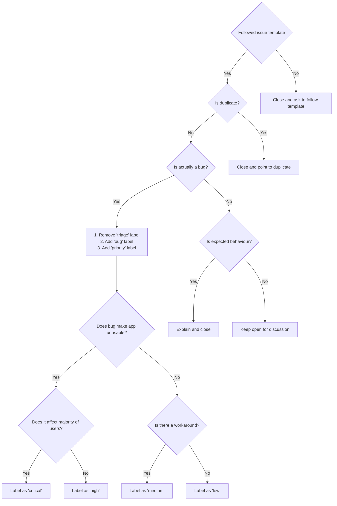
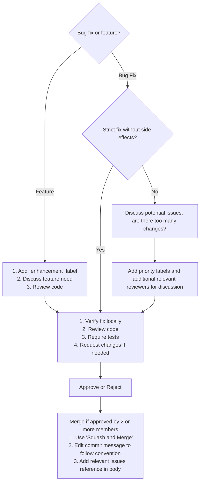

# TERArium Contributing Guide

Hi! We're really excited that you're interested in contributing to TERArium! Before submitting your contribution, please
read through the following guide.

## Repository Setup

The TERArium repo is a mixed repo using yarn workspaces and Java backend components. The package managers used to
install and link dependencies are [yarn](https://yarnpkg.com/getting-started) and [gradle](https://gradle.org/).

To develop and test the core application:

1. Stand up the TERArium services by running the `deploy-terarium.sh up` script from within the
   [Orchestration](https://github.com/DARPA-ASKEM/orchestration) repository
2. To stop a pod from running in kubernetes so that you can run locally to debug, run the following commands from the
   orchestration repo's `kubernetes/local` directory. Replace `[NAME]` with the name of the service you would like to
   stop (e.g. `hmi-client` or `hmi-server`).

- `kubectl delete -f [NAME]-deployment.yaml -f [NAME]-service.yaml`

3. Start a service locally to replace the services you shut down

- Start up the Backend Quarkus server using `./gradlew quarkusDev` or `quarkus dev` command
- Start the front end by doing `yarn install` followed by `yarn && yarn dev`

4. Navigate your browser to `localhost:8078`
5. You can start services back up in kubernetes by running the following commands from the
   orchestration repo's `kubernetes/local` directory. Replace `[NAME]` with the name of the service you would like to
   stop (e.g. `hmi-client` or `hmi-server`).

- `kubectl apply -f [NAME]-deployment.yaml -f [NAME]-service.yaml`

## Container Registry Setup

This project uses GitHub Container Registry as its hub. In order to push and pull images generated by the repositories
you need to login into the registry. By default packages are private to members of the organization so if you have
access to the repository you will have access to the registry after login ing.

### Login To Registry

1. Create a new personal access token (classic) with the appropriate scopes for the tasks you want to accomplish. If
   your organization requires SSO, you must enable SSO for your new token.

   > Note: By default, when you select the write:packages scope for your personal access token (classic) in the user
   interface, the repo scope will also be selected. The repo scope offers unnecessary and broad access. As a workaround,
   you can select just the write:packages scope for your personal access token (classic) in the user interface with this
   url: https://github.com/settings/tokens/new?scopes=write:packages.

- Select the read:packages scope to download container images and read their metadata.
- Select the write:packages scope to download and upload container images and read and write their metadata.
- Select the delete:packages scope to delete container images.

For more information,
see [Creating a personal access token for the command line](https://docs.github.com/en/github/authenticating-to-github/creating-a-personal-access-token-for-the-command-line)
.

2. Save your personal access token (classic). We recommend saving your token as an environment variable.

```sh
export CR_PAT=YOUR_TOKEN
```

3. Using the CLI for your container type, sign in to the Container registry service at ghcr.io.

```sh
echo $CR_PAT | docker login ghcr.io -u USERNAME --password-stdin
Login Succeeded
```

### Kubernetes

To have Kubernetes access a private container image or repository it needs to have a generated secret available to do
so. For use with the GitHub Container Registry you will again need a `Personal Access Token`(PAT), or reuse the same one
as before.

#### Create Secret

To create the secret for kubernetes use the following command:

```sh
kubectl create secret docker-registry ghrc_cred \ 
	--docker-server=<your-registry-server> \
	--docker-username=<your-name> \
	--docker-password=<your-pword> \
	--docker-email=<your-email>
```

where:

- `<your-registry-server>` is `ghcr.io` for the GitHub Registry
- `<your-name>` is your GitHub username.
- `<your-pword>` is your GitHub PAT.
- `<your-email>` is your email (optional)

You have successfully set your credentials in the cluster as a Secret called `ghrc_cred`.

#### Verify Secret

To verify that the secret was generated use:

```sh
kubectl get secret ghrc_cred --output=yaml
```

#### Use Secret In Pod

To apply the secret to a `pod` simply reference it within the spec using the `imagePullSecrets` property.

Here is an example POD that accesses the secret credentials generated above.

```yml
apiVersion: v1
kind: Pod
metadata:
  name: private-reg
spec:
  containers:
    - name: private-reg-container
      image: <your-private-image>
  imagePullSecrets:
    - name: regcred
```

## Debugging Front End

To debug the front end you need:

1. Add a `debugger` statement where you want to stop the code execution.

2. Click the "Run and Debug" icon in the activity bar of the editor, which opens the [_Run and Debug
   view_](https://code.visualstudio.com/docs/editor/debugging#_run-and-debug-view).

3. Click the "JavaScript Debug Termimal" button in the _Run and Debug view_, which opens a terminal in VS Code.

## Releasing

New docker images are automatically built when changes are pushed into `main`. This will generate all images with
the `latest` tag associated with it. For releasing of new stable versions simply add a git tag on `main` of the
form `v#.#.#` or `v#.#.#-[a..z]`. This will automatically trigger a retagging of the latest build with the specified
tag.

> NOTE: Careful that you wait until the main build has completed so that the tag is pulling the correct `latest`

---

## Debugging Backend

???

## Running Tests

### Integration Tests

Each package contains a `tests` directory which may contain one or both of `e2e` and `ct` subdirectories. The tests are
run using [Vitest](https://vitest.dev/) + [Playwright](https://playwright.dev/).

Before running the tests, make sure that TERArium has installed dependencies and has been built.

- `yarn test:e2e` by default runs every integration across all 3 browsers (Chromium, FireFox, WebKit)
- `yarn test:ct` runs component specific tests

#### Writing Integration Tests

Tests have access to the `page` object from Playwright ([`Page`](https://playwright.dev/docs/api/class-page)) instance
that has already navigated to the served main page. So, writing a test is as simple as:

```ts
import {test, expect} from '@playwright/test';

test('should work', async (page) => {
  expect(await page.textContent('.foo')).toMatch('foo')
})
```

### Unit Tests

Along with integration tests, packages also contain unit tests under their `tests/unit` directory. Unit tests are
powered by [Vitest](https://vitest.dev/). The detailed config is either inside `vite.config.ts` or `vitest.config.ts`
files.

- `yarn test` runs unit tests under each package.

#### Writing Unit Tests

Writing unit tests is simple and very similar to integration tests. Unit tests also have the same APIs as JEST so if you
are familiar with that this should be simple:

```ts
import {assert, describe, expect, it} from 'vitest';

describe('basic tests', () => {
  it('should have the correct square root', () => {
    assert.equal(Math.sqrt(4), 2);
  });
});
```

## Pull Request Guidelines

- Checkout a branch from a base branch (`main`), and merge back against that branch.

- If adding a new feature:
  - Add accompanying test case.
  - Provide a convincing reason to add this feature. Ideally, you should open a suggestion issue first, and have it
    approved before working on it.
  - Reference the feature ticket if applicable

- If fixing a bug:
  - Reference the issue being resolved by adding (resolves #123)
  - Provide a detailed description of the bug in the PR. Live demo preferred.
  - Add appropriate test coverage if applicable.

- It's OK to have multiple small commits as you work on the PR. GitHub will automatically squash them before merging.

- Make sure tests pass!

- Follow the PR template guide to submit your PR with the appropriate required information for review.

- PR title must follow the [commit message convention](../Conventional%20Commits%20Cheat%20Sheet.pdf) so that changelogs
  can be automatically generated. PR messages are automatically validated before being able to be merged by the use of
  GitHub Workflows.

- No need to worry about code style as long as you have installed the dev dependencies. Modified files are automatically
  formatted with Prettier on commit (by invoking [Git Hooks](https://git-scm.com/docs/githooks)
  via [Husky](https://typicode.github.io/husky/#/)).

## Maintenance Guidelines

> The following section is mostly for maintainers who have commit access, but it's helpful to go through if you intend
> to make non-trivial contributions to the codebase.

### Issue Triaging Workflow



### Pull Request Review Workflow


