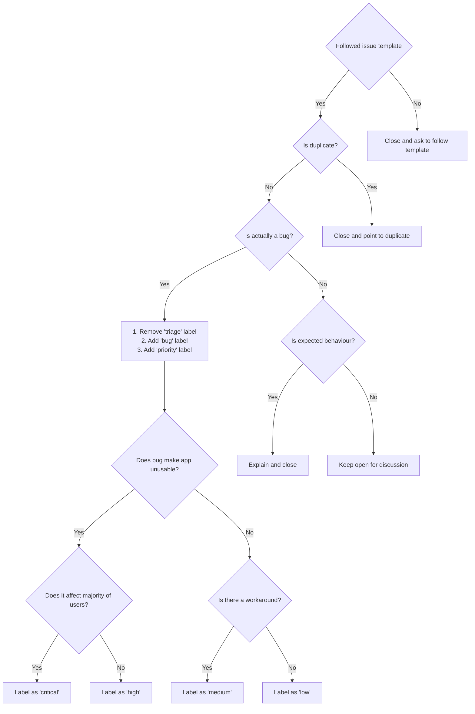

# TERArium Contributing Guide

Hi! We're really excited that you're interested in contributing to TERArium! Before submitting your contribution, please read through the following guide.

## Repo Setup

The TERArium repo is a mixed repo using yarn workspaces and Java backend components. The package manager used to install and link dependencies is [yarn](https://yarnpkg.com/getting-started) and [gradle](https://gradle.org/).

To develop and test the core application:

1. Stand up the Gatweay servers by running the `gateway.sh up` script from within the `kubernetes/local` directory.
2. Start up the Backend Quarkus server using `./gradlew quarkusDev` or `quarkus dev` command
3. Start the front end by doing `yarn install` followed by `yarn workspaces webapp dev`
4. Navigate your browser to `localhost:8078` 

## Debugging Front End

To debug the front end you need:

1. Add a `debugger` statement where you want to stop the code execution.

2. Click the "Run and Debug" icon in the activity bar of the editor, which opens the [_Run and Debug view_](https://code.visualstudio.com/docs/editor/debugging#_run-and-debug-view).

3. Click the "JavaScript Debug Termimal" button in the _Run and Debug view_, which opens a terminal in VS Code.

## Debugging Backend

???

## Running Tests

### Integration Tests

Each package contains a `tests` directory which may contain one or both of `e2e` and `ct` subdirectories. The tests are run using [Vitest](https://vitest.dev/) + [Playwright](https://playwright.dev/).

Before running the tests, make sure that TERArium has installed dependencies and has been built.

- `yarn test:e2e` by default runs every integration across all 3 browsers (Chromium, FireFox, WebKit)
- `yarn test:ct` runs component specific tests

#### Writing Integration Tests

Tests have access to the `page` object from Playwright ([`Page`](https://playwright.dev/docs/api/class-page)) instance that has already navigated to the served main page. So, writing a test is as simple as:

```ts
import { test, expect } from '@playwright/test';

test('should work', async (page) => {
  expect(await page.textContent('.foo')).toMatch('foo')
})
```
### Unit Tests

Along with integration tests, packages also contain unit tests under their `tests/unit` directory. Unit tests are powered by [Vitest](https://vitest.dev/). The detailed config is either inside `vite.config.ts` or `vitest.config.ts` files.

- `yarn test` runs unit tests under each package.

#### Writing Unit Tests

Writing unit tests is simple and very similar to integration tests. Unit tests also have the same APIs as JEST so if you are familiar with that this should be simple:

```ts
import { assert, describe, expect, it } from 'vitest';

describe('basic tests', () => {
	it('should have the correct square root', () => {
		assert.equal(Math.sqrt(4), 2);
	});
});
```

## Pull Request Guidelines

- Checkout a branch from a base branch (`main`), and merge back against that branch.

- If adding a new feature:
  - Add accompanying test case.
  - Provide a convincing reason to add this feature. Ideally, you should open a suggestion issue first, and have it approved before working on it.
  - Reference the feature ticket if applicable

- If fixing a bug:
  - Reference the issue being resolved by adding (resolves #123)
  - Provide a detailed description of the bug in the PR. Live demo preferred.
  - Add appropriate test coverage if applicable.

- It's OK to have multiple small commits as you work on the PR. GitHub will automatically squash them before merging.

- Make sure tests pass!

- PR messages must follow the [commit message convention](../Conventional%20Commits%20Cheat%20Sheet.pdf) so that changelogs can be automatically generated. PR messages are automatically validated before being able to be merged by the use of GitHub Workflows.

- No need to worry about code style as long as you have installed the dev dependencies. Modified files are automatically formatted with Prettier on commit (by invoking [Git Hooks](https://git-scm.com/docs/githooks) via [Husky](https://typicode.github.io/husky/#/)).

## Maintenance Guidelines

> The following section is mostly for maintainers who have commit access, but it's helpful to go through if you intend to make non-trivial contributions to the codebase.

### Issue Triaging Workflow


### Pull Request Review Workflow


