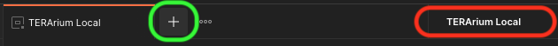

# Using Postman to Test Endpoints

Postman can be used to test the endpoints of our API, but requires some special configuration to authenticate with
keycloak. Follow these steps to get yourself up and running.

1. Download [Postman](https://www.postman.com/) from here. Postman will nag you a bit if you don't set an account up
   with them, so consider doing this too.
2. Under **My Workspace** click Import, then drag and drop the
   file [terarium.postman_globals](../terarium.postman_globals.json) file into the UI.
3. Clicking on **Environments** you should now see an entry called Terarium Local.

4. Ensure that your environment is set to **Terarium Local** and then click on
   the **+** to create a new request.
5. Under the URL, enter `localhost:3000/YOURAPIPATH`. For example, `localhost:3000/api/projects`.
6. Click on **Authorization** and then enter the following values (if a value is missing here assume it is
   skipped/empty)

* Type: `OAuth 2.0`
* Add authroization data to: `Request Headers`
* Access Token: `Available Tokens`
* Header Prefix: `Bearer`
* Token Name: `{{Token Name}}`
* Grant Type: `Authorization Code`
* Authorize using browser: `true`
* Auth URL: `{{Auth URL}}`
* Access Token URL: `{{Access Token URL}}`
* Client ID: `{{Client ID}}`
* Client Secret: `{{Client Secret}}`
* Scope: `{{Scope}}`
* Client Authentication: `Send as Basic Auth header`

7. Once entered, click the **Get New Access Token** button. This will open Terarium in your browser of choice.
8. Log into Terarium.  **You will likely notice your browser block a popup at this time. Click through this warning
   banner to allow popups from this page.**
9. This will bring you back to Postman where you can confirm the token acquired.
10. You should now be able to hit the **Send** button to send your request.

In the future, you will only need to run steps 7-10 once you've done the initial setup once. A new access token will
need to be generated each time you run the server. If you suddenly start getting 401 Unauthorized errors, you just have
to generate a new auth token
