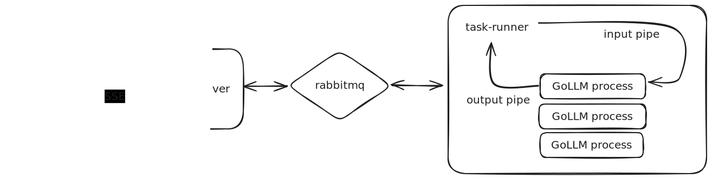

# Terarium Task Runner

This is the async taskrunner for the Terarium Application.

# How it works:



The taskrunner uses RabbitMQ as it's sole interface. It consumes on requests and produces responses through RabbitMQ.

Each request to the taskrunner represents the execution of work. This may be a python program or a standalone executable. *The work that the taskrunner is capable of doing must be built into the taskrunner image.*

When the taskrunner receives a request, it will execute the provided script as a new process. It will then write any provided input bytes into a [named pipe](https://en.wikipedia.org/wiki/Named_pipe) created specifically for the child process. The child process will be provided three arguments: `--input-pipe`, `--output-pipe`, and `--progress-pipe` and is responsible for reading input from the `--input-pipe` and writing intermitant progress to the `--progress-pipe`, and final output to the `--output-pipe`.

The taskrunner will communcate the progress and output back through RabbitMQ to be consumed by another service (ex. `hmi-server`).

# How to build a taskrunner image:

- The `TaskRunnerInterface` class in [taskrunner.py](./taskrunner.py) provides everything necessary for getting input into the task and output back through
the `taskrunner` to the `hmi-server`.

Use the following as a reference for creating a taskrunner image:

    - [MIRA Taskrunner](https://github.com/DARPA-ASKEM/terarium/packages/mira)
    - [GoLLM Taskrunner](https://github.com/DARPA-ASKEM/terarium/packages/gollm)
    - [Funman Taskrunner](https://github.com/DARPA-ASKEM/terarium/packages/funman)

# Local Development:

Everything is setup in the `docker-compose-taskrunner.yml` for local development. The docker-compose entries use the *builder* image and volume mounts the taskrunner directories into the running container. The python repos will automatically pickup and local changes and hotswap accordingly.

**NOTE: When starting these local images, it takes about a minute or so to setup the python code and start the java taskrunner.**

# Building docker images:

From `terarium` root:

```sh
docker build --tag=ghcr.io/darpa-askem/gollm-taskrunner:latest --no-cache --file=./packages/gollm/Dockerfile .
docker build --tag=ghcr.io/darpa-askem/mira-taskrunner:latest --no-cache --file=./packages/mira/Dockerfile .
docker build --tag=ghcr.io/darpa-askem/funman-taskrunner:latest --no-cache --file=./packages/funman/Dockerfile .
```
